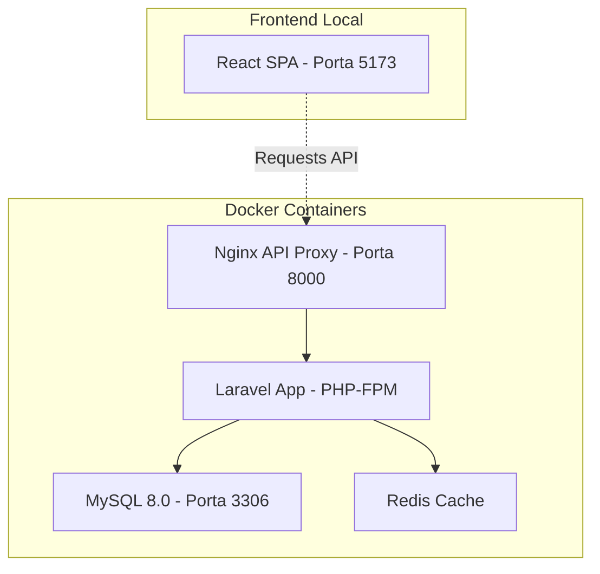

# 🏗️ Chapada Livre - Guia de Configuração e Execução (Docker + React)

Este guia explica como configurar e rodar o projeto **Chapada Livre** no ambiente de desenvolvimento local. O projeto utiliza uma arquitetura moderna e desacoplada:

- **Backend (API):** Laravel 10 + MySQL + Redis (orquestrado via Docker Compose).
- **Frontend (SPA):** React + Vite + TypeScript (rodando localmente via Node.js).

---

## 📋 Pré-requisitos

Antes de começar, certifique-se de ter instalado:

| Software | Versão Mínima | Link |
|----------|--------------|------|
| **Docker Desktop** | 4.0+ | [docker.com](https://www.docker.com/) |
| **Node.js** | 18+ | [nodejs.org](https://nodejs.org/) |
| **Git** | 2.0+ | [git-scm.com](https://git-scm.com/) |

---

## 🚀 Início Rápido (Backend e Frontend)

Para rodar a aplicação completa localmente, você precisará iniciar os dois ambientes (Backend e Frontend) em terminais separados.

### Passo 1: Subir o Backend (Laravel API via Docker)

Em um terminal, na raiz do projeto (`Chapada-LIvre`):

```bash
# 1. Copie o arquivo de ambiente (se ainda não existir)
cp .env.example .env

# 2. Suba todos os containers do backend
docker-compose up -d --build
```

O container principal (`app`) fará a instalação das dependências do PHP (Composer) e a configuração das chaves automaticamente.
A API do Backend estará disponível em: 🌐 **http://localhost:8000**

> ⚠️ **Nota Importante para o `.env` do Laravel**:
> O `DB_HOST` deve ser mantido como `mysql` (e não `localhost`), e o `REDIS_HOST` como `redis`. O arquivo `.env.example` já está pré-configurado corretamente para o Docker.

### Passo 2: Rodar o Frontend (React / Vite)

Abra um **novo terminal**, navegue até a pasta `react-app` e inicie o ambiente de desenvolvimento:

```bash
# 1. Acesse a pasta do frontend
cd react-app

# 2. Instale as dependências
npm install

# 3. Inicie o servidor de desenvolvimento
npm run dev
```

A Interface Web (Frontend) estará acessível em: 🌐 **http://localhost:5173** (ou a porta exibida no seu terminal).

#### Variáveis de Ambiente do Frontend

Dentro de `react-app/`, há um arquivo `.env`. Certifique-se de configurá-lo para apontar para a sua API local:

```env
# Altere para a URL do seu backend local
VITE_API_TARGET="http://localhost:8000"

# (Para apontar e testar com os dados de produção, mantenha "https://chapadalivre.com.br")
```

---

## 🏛️ Arquitetura (Ambiente de Desenvolvimento)

A infraestrutura da API utiliza 4 containers gerenciados pelo Docker Compose, enquanto o Frontend Roda separadamente pelo Node.



| Container | Imagem | Função | Porta |
|-----------|--------|--------|-------|
| `laravel_app` | `php:8.2-fpm` | Executa o código PHP/Laravel (API) | 9000 (interna) |
| `laravel_nginx` | `nginx:alpine` | Proxy reverso para a API Laravel | **8000** → 80 |
| `laravel_mysql` | `mysql:8.0` | Banco de dados | **3306** |
| `laravel_redis` | `redis:alpine` | Cache e filas de tarefas | 6379 (interna) |

> *O frontend (React) roda fora do Docker no desenvolvimento para garantir a melhor performance do Vite e do Hot Module Replacement (HMR).*

---

## 📖 Comandos Úteis

### Backend (Docker)

```bash
# Ver status de todos os containers
docker-compose ps

# Parar os containers sem apagar os dados
docker-compose down

# Parar containers e remover os volumes (⚠️ apaga o banco de dados!)
docker-compose down -v

# Acompanhar os logs da aplicação e erros em tempo real
docker-compose logs -f app

# Executar migrations e alimentar o banco de dados com cidades
docker-compose exec app php artisan migrate --force
docker-compose exec app php artisan db:seed --class=ChapadaDiamantinaCitiesSeeder --force
```

### Banco de Dados

```bash
# Acessar o console do MySQL (Dica: A senha padrão é 'password')
docker-compose exec mysql mysql -ularavel -ppassword laravel

# Fazer backup do banco (Dump)
docker-compose exec mysql mysqldump -ularavel -ppassword laravel > backup.sql
```

---

## 🐛 Resolução de Problemas Frequentes

### 1. Frontend não consegue se conectar à API (Erro de CORS)
**Sintoma:** Você clica em botões no React e nada acontece ou a aba Network do navegador acusa problema de "CORS".
**Solução:** 
1. Confirme se o arquivo `react-app/.env` está utilizando a variável `VITE_API_TARGET="http://localhost:8000"`.
2. Certifique-se de que as permissões de CORS do Laravel (no backend) estejam liberando a origem `http://localhost:5173`.

### 2. O Banco de Dados "recusa" a conexão
**Causa:** O container do MySQL pode demorar até 30 segundos para completar a primeira inicialização.
**Solução:** Se o Laravel acusar "Connection refused" ou o React falhar em carregar os dados na primeira vez, apenas aguarde alguns segundos e atualize a página. O Docker tentará reconectar a API ao MySQL automaticamente.

### 3. Erro "Permission denied" no Storage da API
**Causa:** O servidor local ou Docker perdeu a permissão sobre as pastas de armazenamento de cache/logs do Laravel.
**Solução:** Execute o comando para reatribuir o dono (`www-data`) da pasta `storage`:
```bash
docker-compose exec app chown -R www-data:www-data /var/www/storage /var/www/bootstrap/cache
```

---

## 🔄 Resetar o Ambiente de Desenvolvimento

Se precisar recomeçar do zero e limpar tudo (dados, dependências, etc):

```bash
# 1. Parar containers e limpar banco de dados do Docker
docker-compose down -v

# 2. Apagar pastas de dependências
rm -rf vendor node_modules
rm -rf react-app/node_modules

# 3. Subir o Backend novamente (vai instalar tudo do zero)
docker-compose up -d --build

# 4. Instalar o Frontend novamente
cd react-app
npm install
npm run dev
```
